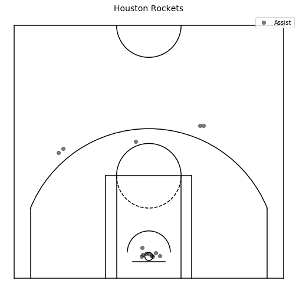

# location_data
Generating shot, foul, and assist charts

## Description

This repo contains a notebook (`location_data.ipynb`) that explores the `shotchartdetail` and `playbyplayv2` endpoint of the [stats.nba.com](https://stats.nba.com) API. With the `Player` and `PlayByPlay` classes of the `py_ball` package, the notebook walks through generating shot, foul, and assist charts.

## Results

These shot charts are from a 1/21/19 contest between the 76ers and Rockets.

### Shot Charts

The Rockets played to their strengths by shooting three-point and restricted area field goals almost exclusively. However, the 76ers blew out the Rockets, 121-93, in part due to their ability to get good looks at the rim.

### Assist Charts

The Sixers also won the assist battle 21-14. The charts show that the Sixers were able to create more assisted three-point field goals than the Rockets.

### Foul Charts

Joel Embiid and James Harden have a reputation for drawing fouls. This game does not refute that notion, with the foul charts showing six trips to the line for Joel Embiid and four for James Harden.

